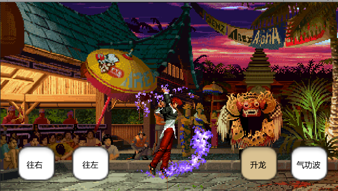
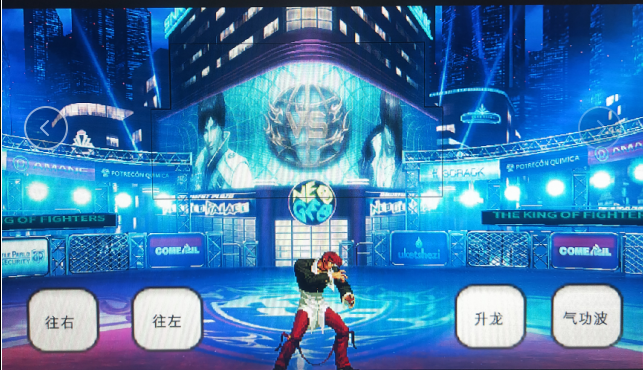

## 项目介绍

基于Mugen部分配置的Unity版本重置。

## 开发工具版本
UNITY 5.3.8 或者 UNITY 2018 或者 UNITY 2019，都已做兼容性测试。

## 【目前进展】
1. 资源打包更新加载代码。包括：框架，声音，角色def, air, act等。

2. 与Mugen不同之处在于cns和cmd，采用LUA来编写。配备了简易的基于xNode节点模式的编辑器（初步版本），用来
	生成代码段。

3. 完成了技能基础流程。

----------

## 【未完成部分】
1. HitBy和NoHit等打击部分。
2. 部分一些SCtrl和Triggle，包括使用方式。
3. 界面库以及一些战斗周边逻辑

## 【目前运行展示】

